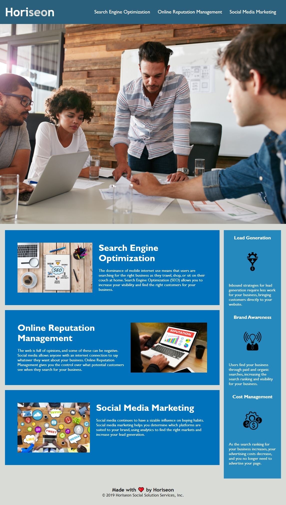

# Week 1 Challenge - Code Refactor

## Description
This repository contains the refactored code for the Horiseon homepage to improve accessibility standards. The source code is improved by adding a title, adding semantic HTML elements, making sure elements and headers follow a logical structure, including alt attributes to images, and consolidating CSS styling.

## Usage
The homepage can be viewed via Github pages using the following link: [Horiseon Agency](https://djamz919.github.io/bootcamp-week1-challenge/)
